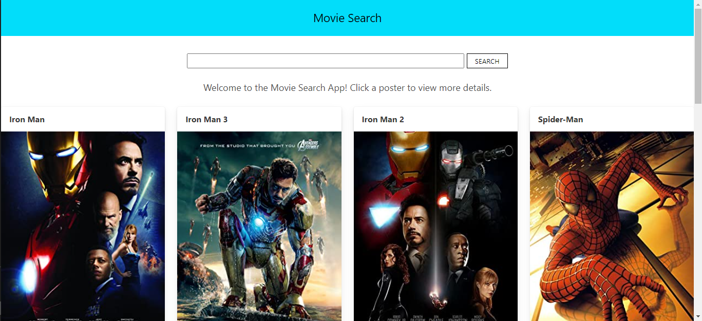
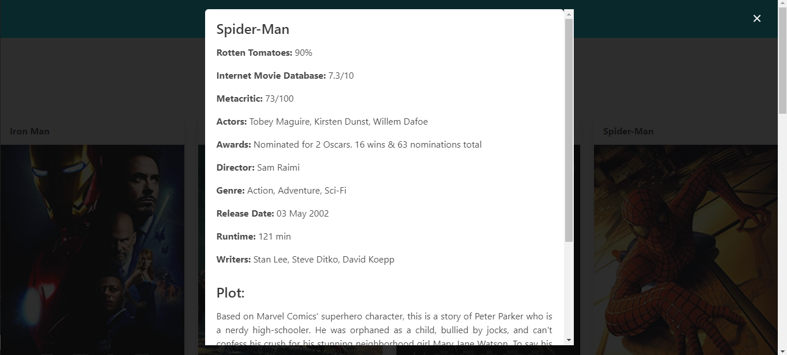

# MovieSearchApp 

  ## Description
* An app to search for any movie
* Clicking a poster displays more data about the movie selected
* Uses React and http://www.omdbapi.com/
* Built following the tutorial found at [Link](https://www.freecodecamp.org/news/how-to-build-a-movie-search-app-using-react-hooks-24eb72ddfaf7/)

  
  
  ## Table of Contents
  * [Technologies](#technologies)
  * [Usage](#usage)
  * [Contributing](#contributing)
  * [License](#license)
  
  ## Technologies

* This project is built using the following:
    * HTML
    * CSS
    * Javascript
    * React.js
    * Bulma

  ## Usage

* Visit the [Live Webpage](https://am-movie.herokuapp.com/)

  ## App
  ### Welcome Screen
  

  ### Info Screen
  

  ## Contributing

  For contributions please open an issue or new pull request

  ## Test

  n/a
  
  ## Questions

  I can answer questions via email or through github

  * Github Profile: [Alec74](https://github.com/Alec74)
  * alecmcglone@gmail.com
  * LinkedIn Profile: [AlecM](https://www.linkedin.com/in/alec-mcglone-900904206/)
  
  ## License
  Notice: This application is licensed under MIT
  
  [License-Link](./LICENSE)